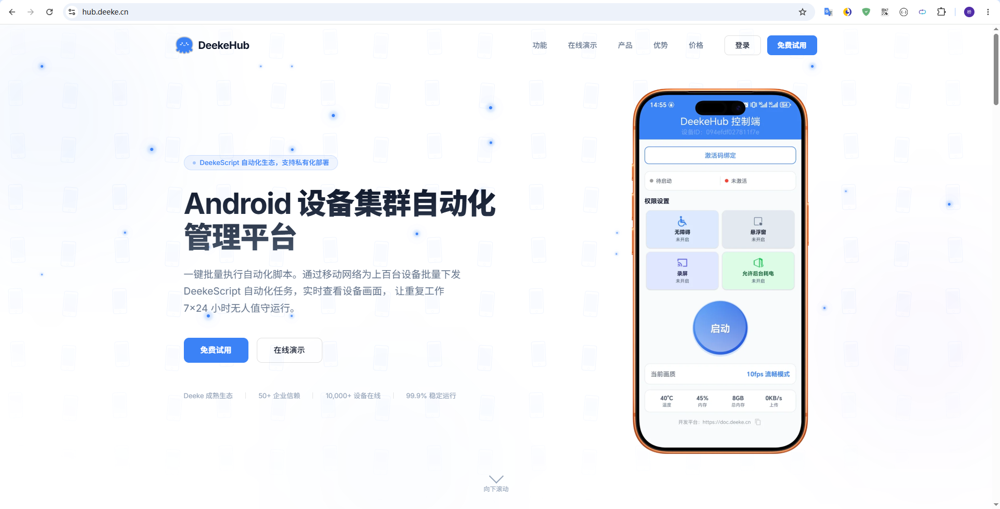
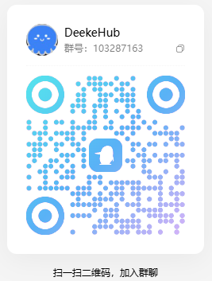

# DeekeHub自动化脚本远程执行平台

> 一个面向开发者和企业的 Android 群控与自动化管理平台。

`体验地址：https://hub.deeke.cn`

```本开源项目仅包括后端api和后端页面部分，Android端仅支持局域网内使用，源码和商业版支持，请联系作者~```

DeekeHub 是一款专注于 **Android 群控、设备管理、自动化脚本执行** 的开源平台，帮助开发者快速搭建自己的云控系统。平台支持多设备统一管理、批量任务下发、实时设备状态监控、远程控制、脚本调度以及开放 API，可作为企业级自动化、RPA、设备农场（Device Farm）或私有化群控系统的基础框架。

相比传统群控软件，DeekeHub 更偏向开发者生态，不绑定具体业务，可自由扩展到短视频运营、应用测试、设备管理、AI 数字员工、企业自动化办公等各种场景。通过标准化的设备管理架构和插件化设计，开发者可以快速接入自己的 Android 应用、自动化引擎或 AI 能力，打造属于自己的自动化平台。

如果你正在寻找 **Android 群控、云控、设备管理、自动化框架、Accessibility 自动化、远程控制、多设备管理、RPA、Device Farm** 等相关开源项目，希望这个项目能够帮助到你，也欢迎一起参与完善。

**如果这个项目对你有所帮助，欢迎 Star ⭐，也欢迎提交 Issue 和 PR，一起打造更好用的 Android 自动化平台。**

#### 首页截图




#### 部署文档

> 下载Android端APP：<a href='./github/v1.3.03-release.apk'>v1.3.03-release.apk</a>

> DeekeHub后端部署文档：<a href='./DeekeHub.md'>查看部署文档</a>


#### 进群交流


